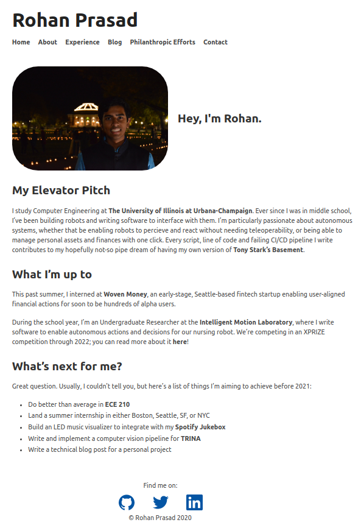

## Personal Website

This is the first iteration of my personal website, built in August of 2020. It serves as a personal portfolio of myself. 

### Color Palette

I mostly mimiced my school's color pallete (The University of Illinois). You can find the two shades below:

 `(Alma Orange)`  
 `(Illinois Blue)`  (Illinois Blue)

### Resources Used

I used the following, but not limited to, resources

- Ruby
- Jekyll
- Javascript
- CSS Webkit
- ImgIcon

### Final Product

My website is by no means complete. I hope to add to it as I explore new frameworks, and hopefully populate the 'blog' portion with some meaningful writing by the end of 2021. You can check it out at [rohanprasad.me](http://rohanprasad.me).

### Preview

Here's a snapshot of the site:

